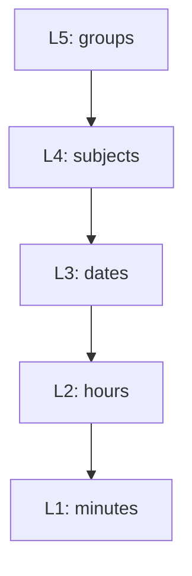

## Introduction

Current practice of assessing mood episodes in Major Depression Disorders (MDD) largely depends on subjective observations combined with semi-structured clinical rating scales. Motor activity is an objective observation of the inner physiological state expressed in behavior patterns. Alterations of motor activity are essential features of MDD.

prevent at begining

The aim was to investigate if objective biological measures can aid existing diagnostic practice, by applying machine-learning techniques to analyze motor activity patterns from depressed patients and healthy controls.

## Preprocessing


```r
# Library package
library(tidyverse)
library(rsample)
library(caret)
library(vip)
library(tsfeatures)
```

### Setting up dataframe

Load actigraph files.


```r
# condition files
condition_file <- list.files(path = condition_path, pattern = '*.csv', full.names = T)

# control files
control_file <- list.files(path = control_path, pattern = '*.csv', full.names = T)

# number of files
c(condition = length(condition_file), control = length(control_file))
```

```
## condition   control 
##        23        32
```

Create condition data frame.


```r
# Change to UTC timezone
Sys.setlocale("LC_TIME", "C")
```

```
## [1] "C"
```

```r
# read condition files
condition_data <- read_csv(condition_file, id = "ID") %>%
    mutate(ID = parse_number(ID),
           timestamp = as.POSIXct(str_replace_all(timestamp, "/", "-")),
           date = as.Date(str_replace_all(date, "/", "-")),
           group = 'condition')
glimpse(condition_data)
```

```
## Rows: 551,716
## Columns: 5
## $ ID        <dbl> 1, 1, 1, 1, 1, 1, 1, 1, 1, 1, 1, 1, 1, 1, 1, 1, 1, 1, 1, 1, …
## $ timestamp <dttm> 2003-05-07 12:00:00, 2003-05-07 12:01:00, 2003-05-07 12:02:…
## $ date      <date> 2003-05-07, 2003-05-07, 2003-05-07, 2003-05-07, 2003-05-07,…
## $ activity  <dbl> 0, 143, 0, 20, 166, 160, 17, 646, 978, 306, 277, 439, 130, 3…
## $ group     <chr> "condition", "condition", "condition", "condition", "conditi…
```

Create control data frame.


```r
# read control files
control_data <- read_csv(control_file, id = "ID") %>%
    mutate(ID = parse_number(ID) + 23,
           group = 'control')
glimpse(control_data)
```

```
## Rows: 1,019,990
## Columns: 5
## $ ID        <dbl> 24, 24, 24, 24, 24, 24, 24, 24, 24, 24, 24, 24, 24, 24, 24, …
## $ timestamp <dttm> 2003-03-18 15:00:00, 2003-03-18 15:01:00, 2003-03-18 15:02:…
## $ date      <date> 2003-03-18, 2003-03-18, 2003-03-18, 2003-03-18, 2003-03-18,…
## $ activity  <dbl> 60, 0, 264, 662, 293, 0, 322, 1102, 1067, 239, 1174, 121, 37…
## $ group     <chr> "control", "control", "control", "control", "control", "cont…
```

Merge two data frames.


```r
# combine control and condition data
full_df <- rbind(condition_data, control_data) %>%
    mutate(group = as.factor(group))

head(full_df)
```

```
## # A tibble: 6 × 5
##      ID timestamp           date       activity group    
##   <dbl> <dttm>              <date>        <dbl> <fct>    
## 1     1 2003-05-07 12:00:00 2003-05-07        0 condition
## 2     1 2003-05-07 12:01:00 2003-05-07      143 condition
## 3     1 2003-05-07 12:02:00 2003-05-07        0 condition
## 4     1 2003-05-07 12:03:00 2003-05-07       20 condition
## 5     1 2003-05-07 12:04:00 2003-05-07      166 condition
## 6     1 2003-05-07 12:05:00 2003-05-07      160 condition
```

Notice that this is a multilevel data frame



### Cleaning data

Visualize data to see overall patterns.


```r
# nest by ID
nest_df <- full_df %>%
    group_by(ID) %>%
    nest() %>%
    arrange(ID)

# plot function
plot_fun <- function(df) {
    ggplot(df, aes(timestamp, activity)) +
        geom_line() +
        theme(axis.text.x = element_blank())
}

# create plot columns
nest_df <- nest_df %>%
    mutate(plot = map(data, plot_fun))

# condition plots
grid.arrange(grobs = nest_df$plot[1:23], ncol = 4)
```

}}index.en_files/figure-html/unnamed-chunk-7-1.png" width="672" />

```r
# control plots, cause it's too many plots if we put all of them in one figure,
# we'll separate plotting them
grid.arrange(grobs = nest_df$plot[24:39], ncol = 4)
```

}}index.en_files/figure-html/unnamed-chunk-7-2.png" width="672" />

```r
grid.arrange(grobs = nest_df$plot[40:55], ncol = 4)
```

}}index.en_files/figure-html/unnamed-chunk-7-3.png" width="672" />

It seems like some of days subjects didn't record activity, so we'll have to remove those days. We'll remove every day with sub-threshold activity (threshold = 25). In this way, we'll preserve whitin day variability.


```r
# filter where doesn't fit threshold
clean_df <- full_df %>%
    group_by(ID, date) %>%
    mutate(mean_perday = mean(activity)) %>%
    # mean activity per day threshold: 25
    filter(mean_perday > 25)

# see the rows difference
list(full = dim(full_df), clean_subact = dim(clean_df))
```

```
## $full
## [1] 1571706       5
## 
## $clean_subact
## [1] 1202071       6
```

There may be some days that's not completed record for 24 hr, which means fewer than 24\*60 = 1440 mins.


```r
# check if there any days that's < 1440 mins
clean_df %>% 
    group_by(ID, date) %>%
    count() %>%
    filter(n < 1440)
```

```
## # A tibble: 73 × 3
## # Groups:   ID, date [73]
##       ID date           n
##    <dbl> <date>     <int>
##  1     1 2003-05-07   720
##  2     2 2003-05-07   540
##  3     2 2003-06-03   946
##  4     3 2003-06-03   948
##  5     4 2003-06-03   721
##  6     5 2003-06-12   810
##  7     6 2003-08-19   720
##  8     7 2004-05-04   840
##  9     7 2004-05-19  1175
## 10     8 2004-05-06   840
## # ℹ 63 more rows
```


```r
# remove the rows that's not completed
clean_df <- clean_df %>%
    group_by(ID, date) %>%
    mutate(minutes = length(timestamp)) %>%
    filter(minutes == 1440)

# see the difference
list(full = dim(full_df), clean_comact = dim(clean_df))
```

```
## $full
## [1] 1571706       5
## 
## $clean_comact
## [1] 1140480       7
```

## Exploratory Data Analysis

### Summarizing days by group


```r
# summary of the days between groups
day_df <- clean_df %>% 
    group_by(ID) %>% 
    summarise(day = length(unique(date))) %>%
    mutate(group = as.factor(ifelse(ID <= 23, 'condition', 'control')))

psych::describeBy(day_df, group = day_df$group)
```

```
## 
##  Descriptive statistics by group 
## group: condition
##        vars  n mean   sd median trimmed mad min max range skew kurtosis   se
## ID        1 23 12.0 6.78     12   12.00 8.9   1  23    22 0.00    -1.36 1.41
## day       2 23 14.3 1.79     14   14.16 0.0  10  19     9 0.64     1.53 0.37
## group*    3 23  1.0 0.00      1    1.00 0.0   1   1     0  NaN      NaN 0.00
## ------------------------------------------------------------ 
## group: control
##        vars  n  mean   sd median trimmed   mad min max range skew kurtosis   se
## ID        1 32 39.50 9.38   39.5   39.50 11.86  24  55    31 0.00    -1.31 1.66
## day       2 32 14.47 1.41   14.0   14.15  0.00  13  21     8 3.28    11.68 0.25
## group*    3 32  2.00 0.00    2.0    2.00  0.00   2   2     0  NaN      NaN 0.00
```


```r
# sum of days
day_df %>% 
    group_by(group) %>%
    summarise(count = sum(day))
```

```
## # A tibble: 2 × 2
##   group     count
##   <fct>     <int>
## 1 condition   329
## 2 control     463
```

|       | Condition | Control |
|-------|-----------|---------|
| total | 329       | 463     |
| mean  | 14.30     | 14.47   |
| sd    | 1.79      | 1.41    |
| min   | 10        | 13      |
| max   | 19        | 21      |

: Descriptive statistics of collected days by group

### Activity between groups

We majorly choose three statistical features that extracted from date level (L3) in this step.

Which are:

- Mean activity within a day

- standard deviation of activity within a day

- The proportion of minutes with an activity level of zero within a day

We may hypothesis that condition group would have lower mean activity, higher variety of activity, and higer zero activity of proportion in a day, compare to control group.

#### Overall 24hr span

Because the activity isn't normal distribution, we have to normalize it before further calculation. Here we use log transformation to adjust skewness.


```r
# calculate mean activity after log transform
clean_df <- clean_df %>% 
    group_by(ID, date) %>% 
    mutate(log_activity = log(activity + 1),
           mean_activity = mean(log_activity),
           sd_activity = sd(log_activity), # sd for per day per person
           zero_prop = zero_proportion(log_activity))

# select needed columns and filter rows
group_act <- clean_df %>%
    select(ID, group, date, mean_activity, sd_activity, zero_prop) %>%
    distinct() 

# box plot for this three vars
reshape2::melt(group_act[, c(2, 4:6)], id.vars="group") %>%
    # Everything on the same plot
    ggplot(., aes(group, value, col = variable)) + 
      geom_boxplot()
```

}}index.en_files/figure-html/unnamed-chunk-13-1.png" width="672" />

It seems like there're still remaining noisy activity even though we've already log transformed data.


```r
# summarise group activity
group_act %>%
    group_by(group) %>%
    summarise(mean = mean(mean_activity),
              sd = mean(sd_activity),
              zero_prop = mean(zero_prop))
```

```
## # A tibble: 2 × 4
##   group      mean    sd zero_prop
##   <fct>     <dbl> <dbl>     <dbl>
## 1 condition  2.80  2.50     0.407
## 2 control    3.44  2.63     0.325
```

The descriptive statistic looks make sense, expect for the variance. Let's see if the differences are significant or not.


```r
# test for homogeneity in variances
car::leveneTest(mean_activity ~ group, data = group_act)
```

```
## Levene's Test for Homogeneity of Variance (center = median)
##        Df F value    Pr(>F)    
## group   1  13.867 0.0002101 ***
##       790                      
## ---
## Signif. codes:  0 '***' 0.001 '**' 0.01 '*' 0.05 '.' 0.1 ' ' 1
```

```r
car::leveneTest(sd_activity ~ group, data = group_act)
```

```
## Levene's Test for Homogeneity of Variance (center = median)
##        Df F value  Pr(>F)  
## group   1  3.0753 0.07988 .
##       790                  
## ---
## Signif. codes:  0 '***' 0.001 '**' 0.01 '*' 0.05 '.' 0.1 ' ' 1
```

```r
car::leveneTest(zero_prop ~ group, data = group_act)
```

```
## Levene's Test for Homogeneity of Variance (center = median)
##        Df F value    Pr(>F)    
## group   1  25.158 6.526e-07 ***
##       790                      
## ---
## Signif. codes:  0 '***' 0.001 '**' 0.01 '*' 0.05 '.' 0.1 ' ' 1
```

Since the inhomogeneous variance, so we have to set `var.equal = FALSE` for mean and zero proportion, and `var.equal = TRUE` for sd.


```r
# corresponding two sample t-test

# mean: condition less than control
t.test(mean_activity ~ group, data = group_act, alternative = "less", var.equal = FALSE)
```

```
## 
## 	Welch Two Sample t-test
## 
## data:  mean_activity by group
## t = -10.62, df = 655.24, p-value < 2.2e-16
## alternative hypothesis: true difference in means between group condition and group control is less than 0
## 95 percent confidence interval:
##        -Inf -0.5355071
## sample estimates:
## mean in group condition   mean in group control 
##                2.804915                3.438724
```

```r
# sd: condition greater than control
t.test(sd_activity ~ group, data = group_act, alternative = "greater", var.equal = TRUE)
```

```
## 
## 	Two Sample t-test
## 
## data:  sd_activity by group
## t = -5.3539, df = 790, p-value = 1
## alternative hypothesis: true difference in means between group condition and group control is greater than 0
## 95 percent confidence interval:
##  -0.1671776        Inf
## sample estimates:
## mean in group condition   mean in group control 
##                2.498502                2.626354
```

```r
# zero proportion: condition greater than control
t.test(zero_prop ~ group, data = group_act, alternative = "greater", var.equal = FALSE)
```

```
## 
## 	Welch Two Sample t-test
## 
## data:  zero_prop by group
## t = 6.706, df = 577.94, p-value = 2.385e-11
## alternative hypothesis: true difference in means between group condition and group control is greater than 0
## 95 percent confidence interval:
##  0.06231984        Inf
## sample estimates:
## mean in group condition   mean in group control 
##               0.4071576               0.3245410
```

|                 | Condition | Control |             |
|-----------------|-----------|---------|-------------|
| mean            | 2.80      | 3.44    | *p \< .001* |
| sd              | 2.50      | 2.63    | *p = 1*     |
| zero proportion | 0.41      | 0.32    | *p \< .001* |

: Characteristics of the depressed patients and healthy controls in 24hr activity

#### Under hourly span

The activity were normalized (range: 0-1) across both groups to make them comparable. Here we'll use the heat map and line graph to compare activities between groups by hours.


```r
# add normal and hour columns
clean_df <- clean_df %>%
    mutate(normal_zerone = scales::rescale(log_activity),
           hour = hour(timestamp))

# heat map
heat_plot <- clean_df %>%
    group_by(group, hour) %>%
    summarise(activity = mean(normal_zerone)) %>%
    ggplot(., aes(group, hour, fill = activity)) + 
        geom_tile() +
        scale_fill_gradient(low = "white", high = "blue")

# line plot
line_plot <- clean_df %>%
    group_by(group, hour) %>%
    summarise(activity = mean(normal_zerone)) %>%
    ggplot(., aes(hour, activity, color = group)) +
        geom_line()

grid.arrange(heat_plot, line_plot, ncol = 1)
```

}}index.en_files/figure-html/unnamed-chunk-17-1.png" width="672" />

It's interesting that control group have a opposite circadian rhythms as we thought. But we can see from the heat map that condition group may have a slightly lower activity compare to control group.

## Modeling

### Feature extraction

Beside of mean, standard deviation, and zero proportion of activity, we'll extract other features based on previous studies.


```r
# set up final features df for ML
feature_df <- clean_df %>%
    group_by(ID, date) %>%
    summarise(
        mean_act = mean(log_activity),
        sd_act = sd(log_activity), 
        zero_prop = zero_proportion(log_activity),
        # Coefficient of variation
        cv_act = sd_act / mean_act, 
        skew_act = psych::skew(log_activity),
        kurtosi_act = psych::kurtosi(log_activity),
        max_act = max(log_activity),
        q99_act = quantile(log_activity, probs = 0.99),
        q75_act = quantile(log_activity, probs = 0.75),
        q25_act = quantile(log_activity, probs = 0.25),
        med_act = median(log_activity),
        #  number of times a time series crosses the median line
        cross_medpoint = crossing_points(log_activity)
    ) %>%
    distinct() %>%
    mutate(group = as.factor(if_else(ID < 24, "condition", "control"))) %>%
    ungroup() %>%
    select(-c("ID", "date"))

feature_df
```

```
## # A tibble: 792 × 13
##    mean_act sd_act zero_prop cv_act skew_act kurtosi_act max_act q99_act q75_act
##       <dbl>  <dbl>     <dbl>  <dbl>    <dbl>       <dbl>   <dbl>   <dbl>   <dbl>
##  1     2.93   2.65     0.409  0.905 -0.00188       -1.74    7.58    6.79    5.53
##  2     2.59   2.58     0.462  0.995  0.180         -1.68    7.42    6.86    5.15
##  3     2.91   2.50     0.374  0.857 -0.0398        -1.60    7.67    7.00    5.22
##  4     2.56   2.41     0.420  0.942  0.147         -1.59    7.64    6.63    4.91
##  5     3.31   2.93     0.394  0.885 -0.0148        -1.69    8.17    7.63    6.22
##  6     2.48   2.50     0.465  1.01   0.232         -1.63    7.73    6.78    5.00
##  7     2.95   2.61     0.397  0.884 -0.0209        -1.67    7.52    7.08    5.43
##  8     2.97   2.67     0.4    0.896  0.00146       -1.70    7.45    7.04    5.53
##  9     3.29   2.62     0.342  0.795 -0.211         -1.60    7.61    7.06    5.67
## 10     2.94   2.67     0.408  0.910  0.0523        -1.66    7.55    7.10    5.53
## # ℹ 782 more rows
## # ℹ 4 more variables: q25_act <dbl>, med_act <dbl>, cross_medpoint <int>,
## #   group <fct>
```


### Splitting train/test set

Create a single 70/30 split of the data.


```r
set.seed(123)

# split train/test
split_data <- initial_split(feature_df, prop = 0.7, strata = 'group')
train_set <- training(split_data)
test_set <- testing(split_data)

# see prop
list(train_num = table(train_set$group),
     train_prop = table(train_set$group) %>% prop.table(), 
     test_num = table(test_set$group),
     test = table(test_set$group) %>% prop.table())
```

```
## $train_num
## 
## condition   control 
##       230       324 
## 
## $train_prop
## 
## condition   control 
## 0.4151625 0.5848375 
## 
## $test_num
## 
## condition   control 
##        99       139 
## 
## $test
## 
## condition   control 
## 0.4159664 0.5840336
```

### Training models

Baseline model: logistic regression

Comparison model: random forest, gradient boosting


```r
set.seed(123)

# Create reusable trainControl
myControl <- trainControl(
  summaryFunction = twoClassSummary,
  classProbs = TRUE, 
  verboseIter = FALSE,
  savePredictions = TRUE,
  index = createFolds(train_set$group, k = 5)
)
```

#### Logistic regression


```r
# train logistic model
model_logis <- train(
    x = train_set[, -13],
    y = train_set$group,
    metric = "ROC",
    method = "glm",
    trControl = myControl,
    preProcess = c("center", "scale")
)
```

```
## Warning: Setting row names on a tibble is deprecated.
```

```
## Warning: glm.fit: fitted probabilities numerically 0 or 1 occurred
```

```
## Warning: Setting row names on a tibble is deprecated.
## Setting row names on a tibble is deprecated.
## Setting row names on a tibble is deprecated.
```

```
## Warning: glm.fit: fitted probabilities numerically 0 or 1 occurred
```

```
## Warning: Setting row names on a tibble is deprecated.
```

```
## Warning: glm.fit: fitted probabilities numerically 0 or 1 occurred
```

```
## Warning: Setting row names on a tibble is deprecated.
```

```r
model_logis
```

```
## Generalized Linear Model 
## 
## 554 samples
##  12 predictor
##   2 classes: 'condition', 'control' 
## 
## Pre-processing: centered (12), scaled (12) 
## Resampling: Bootstrapped (5 reps) 
## Summary of sample sizes: 111, 110, 111, 111, 111 
## Resampling results:
## 
##   ROC        Sens      Spec     
##   0.7692609  0.601087  0.7947312
```


```r
# predict on training set
confusionMatrix(predict(model_logis, train_set), train_set$group)
```

```
## Confusion Matrix and Statistics
## 
##            Reference
## Prediction  condition control
##   condition       142      50
##   control          88     274
##                                           
##                Accuracy : 0.7509          
##                  95% CI : (0.7127, 0.7864)
##     No Information Rate : 0.5848          
##     P-Value [Acc > NIR] : < 2.2e-16       
##                                           
##                   Kappa : 0.4744          
##                                           
##  Mcnemar's Test P-Value : 0.001635        
##                                           
##             Sensitivity : 0.6174          
##             Specificity : 0.8457          
##          Pos Pred Value : 0.7396          
##          Neg Pred Value : 0.7569          
##              Prevalence : 0.4152          
##          Detection Rate : 0.2563          
##    Detection Prevalence : 0.3466          
##       Balanced Accuracy : 0.7315          
##                                           
##        'Positive' Class : condition       
## 
```


```r
# predict on testing set
p_logis <- predict(model_logis, test_set)
confusionMatrix(p_logis, test_set$group)
```

```
## Confusion Matrix and Statistics
## 
##            Reference
## Prediction  condition control
##   condition        56      21
##   control          43     118
##                                         
##                Accuracy : 0.7311        
##                  95% CI : (0.67, 0.7863)
##     No Information Rate : 0.584         
##     P-Value [Acc > NIR] : 1.671e-06     
##                                         
##                   Kappa : 0.4283        
##                                         
##  Mcnemar's Test P-Value : 0.008665      
##                                         
##             Sensitivity : 0.5657        
##             Specificity : 0.8489        
##          Pos Pred Value : 0.7273        
##          Neg Pred Value : 0.7329        
##              Prevalence : 0.4160        
##          Detection Rate : 0.2353        
##    Detection Prevalence : 0.3235        
##       Balanced Accuracy : 0.7073        
##                                         
##        'Positive' Class : condition     
## 
```

#### Random forest


```r
# train random forest
model_rf <- train(
    x = train_set[, -13],
    y = train_set$group,
    metric = "ROC",
    method = "ranger",
    trControl = myControl,
    preProcess = c("center", "scale"),
    tuneGrid = expand.grid(mtry = 1:6,
                           splitrule = 'extratrees',
                           min.node.size = c(1, 5, 10, 15, 20))
)

model_rf
```

```
## Random Forest 
## 
## 554 samples
##  12 predictor
##   2 classes: 'condition', 'control' 
## 
## Pre-processing: centered (12), scaled (12) 
## Resampling: Bootstrapped (5 reps) 
## Summary of sample sizes: 111, 110, 111, 111, 111 
## Resampling results across tuning parameters:
## 
##   mtry  min.node.size  ROC        Sens       Spec     
##   1      1             0.7611344  0.5739130  0.7731571
##   1      5             0.7646370  0.5717391  0.7862845
##   1     10             0.7669326  0.5597826  0.7863202
##   1     15             0.7653110  0.5543478  0.7863172
##   1     20             0.7648092  0.5402174  0.7986546
##   2      1             0.7515239  0.5793478  0.7500119
##   2      5             0.7565536  0.5978261  0.7592842
##   2     10             0.7590473  0.5804348  0.7662489
##   2     15             0.7638667  0.5815217  0.7678081
##   2     20             0.7630869  0.5815217  0.7755242
##   3      1             0.7525677  0.5869565  0.7446035
##   3      5             0.7544946  0.5923913  0.7469379
##   3     10             0.7583241  0.5923913  0.7569854
##   3     15             0.7621535  0.5945652  0.7600802
##   3     20             0.7614219  0.5945652  0.7585566
##   4      1             0.7476590  0.5826087  0.7438343
##   4      5             0.7502180  0.5902174  0.7507900
##   4     10             0.7558959  0.5923913  0.7539056
##   4     15             0.7566593  0.5967391  0.7492991
##   4     20             0.7574641  0.5782609  0.7577695
##   5      1             0.7483794  0.5956522  0.7407395
##   5      5             0.7502643  0.5934783  0.7515622
##   5     10             0.7572490  0.6000000  0.7508108
##   5     15             0.7569141  0.5934783  0.7485120
##   5     20             0.7571797  0.5978261  0.7531482
##   6      1             0.7470944  0.5826087  0.7407574
##   6      5             0.7500589  0.5847826  0.7507871
##   6     10             0.7543805  0.5945652  0.7585269
##   6     15             0.7563624  0.5934783  0.7508227
##   6     20             0.7571670  0.5934783  0.7477576
## 
## Tuning parameter 'splitrule' was held constant at a value of extratrees
## ROC was used to select the optimal model using the largest value.
## The final values used for the model were mtry = 1, splitrule = extratrees
##  and min.node.size = 10.
```


```r
# predict on training set
confusionMatrix(predict(model_rf, train_set), train_set$group)
```

```
## Confusion Matrix and Statistics
## 
##            Reference
## Prediction  condition control
##   condition       180      24
##   control          50     300
##                                           
##                Accuracy : 0.8664          
##                  95% CI : (0.8352, 0.8936)
##     No Information Rate : 0.5848          
##     P-Value [Acc > NIR] : < 2.2e-16       
##                                           
##                   Kappa : 0.7203          
##                                           
##  Mcnemar's Test P-Value : 0.003659        
##                                           
##             Sensitivity : 0.7826          
##             Specificity : 0.9259          
##          Pos Pred Value : 0.8824          
##          Neg Pred Value : 0.8571          
##              Prevalence : 0.4152          
##          Detection Rate : 0.3249          
##    Detection Prevalence : 0.3682          
##       Balanced Accuracy : 0.8543          
##                                           
##        'Positive' Class : condition       
## 
```


```r
# predict on testing set
p_rf <- predict(model_rf, test_set)
confusionMatrix(p_rf, test_set$group)
```

```
## Confusion Matrix and Statistics
## 
##            Reference
## Prediction  condition control
##   condition        65      24
##   control          34     115
##                                           
##                Accuracy : 0.7563          
##                  95% CI : (0.6967, 0.8094)
##     No Information Rate : 0.584           
##     P-Value [Acc > NIR] : 1.969e-08       
##                                           
##                   Kappa : 0.491           
##                                           
##  Mcnemar's Test P-Value : 0.2373          
##                                           
##             Sensitivity : 0.6566          
##             Specificity : 0.8273          
##          Pos Pred Value : 0.7303          
##          Neg Pred Value : 0.7718          
##              Prevalence : 0.4160          
##          Detection Rate : 0.2731          
##    Detection Prevalence : 0.3739          
##       Balanced Accuracy : 0.7420          
##                                           
##        'Positive' Class : condition       
## 
```

#### Gradient boosting 


```r
# train random forest
model_sgb <- train(
    x = train_set[, -13],
    y = train_set$group,
    metric = "ROC",
    method = "gbm",
    trControl = myControl,
    preProcess = c("center", "scale"),
    tuneGrid = expand.grid(interaction.depth = 1:6,
                           shrinkage = 0.1,
                           n.trees = c(50,100,150),
                           n.minobsinnode = c(10, 15, 20)),
    verbose = F
)

model_sgb
```

```
## Stochastic Gradient Boosting 
## 
## 554 samples
##  12 predictor
##   2 classes: 'condition', 'control' 
## 
## Pre-processing: centered (12), scaled (12) 
## Resampling: Bootstrapped (5 reps) 
## Summary of sample sizes: 111, 110, 111, 111, 111 
## Resampling results across tuning parameters:
## 
##   interaction.depth  n.minobsinnode  n.trees  ROC        Sens       Spec     
##   1                  10               50      0.7389696  0.5771739  0.7577547
##   1                  10              100      0.7368173  0.5902174  0.7399970
##   1                  10              150      0.7268049  0.5989130  0.7261152
##   1                  15               50      0.7442915  0.5695652  0.7515830
##   1                  15              100      0.7333810  0.5706522  0.7453965
##   1                  15              150      0.7250280  0.5826087  0.7230116
##   1                  20               50      0.7498747  0.5673913  0.7654678
##   1                  20              100      0.7415561  0.5989130  0.7330472
##   1                  20              150      0.7243846  0.5717391  0.7322721
##   2                  10               50      0.7325252  0.5891304  0.7400238
##   2                  10              100      0.7234852  0.5815217  0.7407781
##   2                  10              150      0.7202395  0.5760870  0.7515682
##   2                  15               50      0.7321629  0.5945652  0.7461746
##   2                  15              100      0.7204846  0.6086957  0.7307247
##   2                  15              150      0.7227326  0.5847826  0.7345797
##   2                  20               50      0.7335033  0.5521739  0.7569647
##   2                  20              100      0.7335237  0.5956522  0.7261123
##   2                  20              150      0.7310884  0.6065217  0.7330353
##   3                  10               50      0.7411954  0.6206522  0.7315177
##   3                  10              100      0.7246410  0.5913043  0.7307247
##   3                  10              150      0.7183311  0.5750000  0.7438551
##   3                  15               50      0.7356363  0.5869565  0.7569765
##   3                  15              100      0.7352013  0.6043478  0.7484823
##   3                  15              150      0.7213458  0.5869565  0.7353371
##   3                  20               50      0.7447470  0.5880435  0.7353490
##   3                  20              100      0.7352334  0.5967391  0.7260558
##   3                  20              150      0.7289278  0.5891304  0.7214464
##   4                  10               50      0.7284998  0.5880435  0.7376448
##   4                  10              100      0.7248497  0.5934783  0.7392011
##   4                  10              150      0.7165060  0.5815217  0.7260766
##   4                  15               50      0.7407832  0.5978261  0.7377072
##   4                  15              100      0.7318730  0.6032609  0.7492634
##   4                  15              150      0.7313032  0.6054348  0.7330621
##   4                  20               50      0.7459702  0.5815217  0.7515652
##   4                  20              100      0.7304224  0.5891304  0.7268934
##   4                  20              150      0.7225643  0.5934783  0.7299525
##   5                  10               50      0.7410625  0.5717391  0.7608435
##   5                  10              100      0.7257187  0.5793478  0.7446005
##   5                  10              150      0.7196140  0.5815217  0.7345590
##   5                  15               50      0.7266487  0.5858696  0.7438432
##   5                  15              100      0.7276545  0.5858696  0.7353430
##   5                  15              150      0.7191342  0.5771739  0.7245619
##   5                  20               50      0.7432950  0.5847826  0.7538759
##   5                  20              100      0.7355242  0.5891304  0.7338343
##   5                  20              150      0.7265072  0.5793478  0.7330294
##   6                  10               50      0.7323237  0.6076087  0.7415325
##   6                  10              100      0.7304650  0.5858696  0.7523404
##   6                  10              150      0.7230208  0.5576087  0.7430650
##   6                  15               50      0.7413264  0.6076087  0.7307722
##   6                  15              100      0.7368218  0.5978261  0.7569647
##   6                  15              150      0.7287631  0.5934783  0.7477042
##   6                  20               50      0.7532788  0.5771739  0.7562251
##   6                  20              100      0.7426711  0.5913043  0.7345916
##   6                  20              150      0.7325956  0.6043478  0.7191387
## 
## Tuning parameter 'shrinkage' was held constant at a value of 0.1
## ROC was used to select the optimal model using the largest value.
## The final values used for the model were n.trees = 50, interaction.depth =
##  6, shrinkage = 0.1 and n.minobsinnode = 20.
```


```r
# predict on training set
confusionMatrix(predict(model_sgb, train_set), train_set$group)
```

```
## Confusion Matrix and Statistics
## 
##            Reference
## Prediction  condition control
##   condition       182      30
##   control          48     294
##                                           
##                Accuracy : 0.8592          
##                  95% CI : (0.8274, 0.8871)
##     No Information Rate : 0.5848          
##     P-Value [Acc > NIR] : < 2e-16         
##                                           
##                   Kappa : 0.7067          
##                                           
##  Mcnemar's Test P-Value : 0.05425         
##                                           
##             Sensitivity : 0.7913          
##             Specificity : 0.9074          
##          Pos Pred Value : 0.8585          
##          Neg Pred Value : 0.8596          
##              Prevalence : 0.4152          
##          Detection Rate : 0.3285          
##    Detection Prevalence : 0.3827          
##       Balanced Accuracy : 0.8494          
##                                           
##        'Positive' Class : condition       
## 
```


```r
# predict on testing set
p_sgb <- predict(model_sgb, test_set)
confusionMatrix(p_sgb, test_set$group)
```

```
## Confusion Matrix and Statistics
## 
##            Reference
## Prediction  condition control
##   condition        66      22
##   control          33     117
##                                           
##                Accuracy : 0.7689          
##                  95% CI : (0.7101, 0.8209)
##     No Information Rate : 0.584           
##     P-Value [Acc > NIR] : 1.591e-09       
##                                           
##                   Kappa : 0.5167          
##                                           
##  Mcnemar's Test P-Value : 0.1775          
##                                           
##             Sensitivity : 0.6667          
##             Specificity : 0.8417          
##          Pos Pred Value : 0.7500          
##          Neg Pred Value : 0.7800          
##              Prevalence : 0.4160          
##          Detection Rate : 0.2773          
##    Detection Prevalence : 0.3697          
##       Balanced Accuracy : 0.7542          
##                                           
##        'Positive' Class : condition       
## 
```


### Comparing models

#### Metrics for evaluation


```r
# Create model_list
model_list <- list(logistic = model_logis, rf = model_rf, sgb = model_sgb)

# Pass model_list to resamples
resamples <- resamples(model_list)

# Summarize the results
summary(resamples)
```

```
## 
## Call:
## summary.resamples(object = resamples)
## 
## Models: logistic, rf, sgb 
## Number of resamples: 5 
## 
## ROC 
##               Min.   1st Qu.    Median      Mean   3rd Qu.      Max. NA's
## logistic 0.7322897 0.7515738 0.7740893 0.7692609 0.7908654 0.7974862    0
## rf       0.7529587 0.7578479 0.7707529 0.7669326 0.7742572 0.7788462    0
## sgb      0.7412603 0.7485206 0.7492656 0.7532788 0.7570505 0.7702968    0
## 
## Sens 
##               Min.   1st Qu.    Median      Mean   3rd Qu.      Max. NA's
## logistic 0.5326087 0.5815217 0.5923913 0.6010870 0.6304348 0.6684783    0
## rf       0.3750000 0.4673913 0.6304348 0.5597826 0.6413043 0.6847826    0
## sgb      0.5108696 0.5271739 0.5326087 0.5771739 0.6358696 0.6793478    0
## 
## Spec 
##               Min.   1st Qu.    Median      Mean   3rd Qu.      Max. NA's
## logistic 0.7297297 0.7374517 0.8230769 0.7947312 0.8378378 0.8455598    0
## rf       0.7153846 0.7374517 0.7837838 0.7863202 0.7953668 0.8996139    0
## sgb      0.6884615 0.7065637 0.7722008 0.7562251 0.8030888 0.8108108    0
```


```r
# Create bwplot, roc
bwplot(resamples, metric = "ROC")
```

}}index.en_files/figure-html/unnamed-chunk-31-1.png" width="672" />


```r
# Create bwplot, Sens
bwplot(resamples, metric = "Sens")
```

}}index.en_files/figure-html/unnamed-chunk-32-1.png" width="672" />


```r
# Create bwplot, Spec
bwplot(resamples, metric = "Spec")
```

}}index.en_files/figure-html/unnamed-chunk-33-1.png" width="672" />

It seems like logistic regression would be the best model to classify depressed and control group on this data.

## Conclusion

Testing set performance, add table here!


```r
# feature importance in logistic model
vip(model_logis, num_features = 12)
```

}}index.en_files/figure-html/unnamed-chunk-34-1.png" width="672" />


