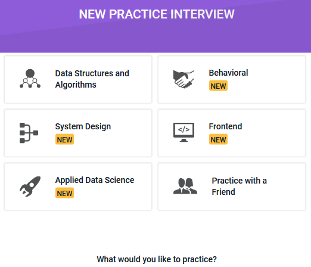

Greeting! I believe you might be interested in how these two platforms work, so that led you to this page. I've been using them for a while, and overall, I highly recommend you give them a try! Here are the reasons:

## Pramp

### What's Pramp?

It's a free, online peer-to-peer platform for practicing technical and behavioral interviews run by Exponent. Learn more on their [website](https://www.pramp.com/#/).

Yeah, it's totally free. Every time you end a session with your peer, you both have to finish a feedback form. If your peer rates you as a good interviewer (3--4 stars), you'll then receive credit to schedule a new interview. Below are the types of interviews you can choose from:

### Pros and Cons

After trying nine mock interviews, I would like to share some pros and cons.

Cons:

Sometimes the peers won't show up on time, I've stood up for the first three interviews. (I admit that I got a little bit annoying during this time, how lucky I was. 🙃) The platform will try to match you with another peer immediately, but if they can't find a match in real-time, you've got to get rid of this interview and book another time.

Pros:

You'll meet a lot of brilliant people from around the world. I've come across people who live in the US, India, and Australia. The advice from more experienced people is always really helpful. I even met two guys who were preparing for Meta and Microsoft's interviews. 😳 The people I've met so far are nice and friendly (I'm grateful for this), some of us even connected on LinkedIn!

## Slowly

### What's Slowly?

This app brings the traditional pen pal experience to smartphones, the farther away your pen pal lives, the longer it will take. Learn more on their [website](https://slowly.app/).

So it's basically a combination of language exchange and a dating app. Well, it's not a Tinder-like dating app, most people on there are usually seeking meaningful conversations, and it's not that efficient to use it for fishing because you have to wait for the letters. 😅

### Pros and Cons

I think the only disadvantage is that when you receive five or more long letters, you'll need to put in more effort and time to reply. Although several pen pals would ghost you, others are quite well to say. I've exchanged letters with people from the US, Ukraine, Russia, Hungary, and Kenya so far. You can truly make friends with people all over the world. Sharing about your cultures, your lives, and anything else you like to talk about. I actually did meet some fantastic pen pals who supported me with warm and professional suggestions. However, the most important thing is that the stories in every letter my dear pen pals shared definitely colored my life!

## Conclusion

By the end of the day, if you're looking for a chance to practice expressing your thoughts verbally and in writing in English or other languages, don't miss these two platforms. And it also gives you the opportunity to interact with people from other countries and even establish long-term friendships. Which is eventually not only beneficial for fostering an international perspective but also for interpersonal skills.
